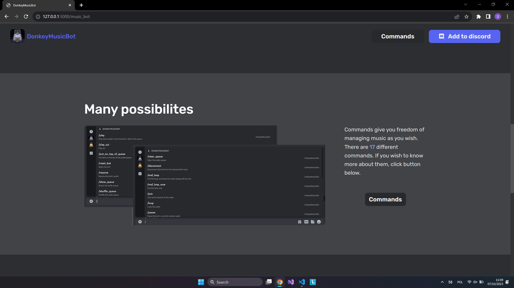
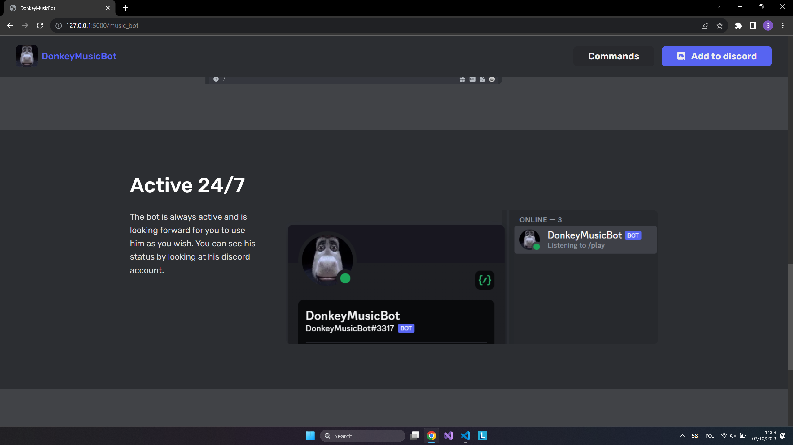
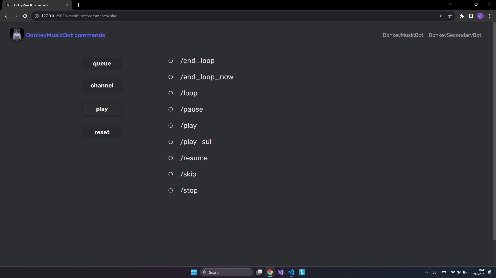

# DonkeyBot


## Invite to your server

<strong>DonkeyMusicBot:</strong> <br>https://discord.com/api/oauth2/authorize?client_id=1151572540075032586&permissions=35461400849472&scope=bot%20applications.commands
<br>
<strong>DonkeySecondaryBot:</strong> <br>https://discord.com/api/oauth2/authorize?client_id=1151580275478896670&permissions=277092756544&scope=bot%20applications.commands

## Features

Both bots use discord slash commands. After typing '/' in discord, you will get hints on how to use them.

### DonkeyMusicBot commands:

- /join
- /play
- /skip
- /loop
- /end_loop
- /end_loop_now
- /pause
- /resume
- /stop
- /disconnect
- /show_queue
- /clear_queue
- /shuffle_queue
- /put_on_top_of_queue
- /reset_bot
- /play_sui

### DonkeySecondaryBot commands:

- /check_country
- /check_marvel_character
- /check_movie
- /random_joke
- /random_fact
- /random_riddle
- /random_cat_image
- /random_num
- /flip_coin

## Requirements

Installation of used python modules:

```bash
pip install -r requirements.txt
```

You must have the <strong>ffmpeg</strong> executable in your path environment variable in order for this to work (reason: *https://discordpy.readthedocs.io/en/stable/api.html?highlight=ffmpeg#ffmpegopusaudio*)

## Environment Variables

To run this project, you will need to add the following environment variables to your .env files

For DonkeyMusicBot (inside main folder):

- `DONKEY_MUSIC_BOT_TOKEN`

For DonkeySecondaryBot (inside main folder):

- `DONKEY_SECONDARY_BOT_TOKEN`

For DonkeySecondaryBot(inside 'secondary_bot' folder)

- `URL_TO_MY_REPO`
- `API_NINJAS_API_KEY`
- `THECATAPI_API_KEY`
- `OMDB_API_API_KEY`
- `MARVEL_API_PUBLIC_KEY`
- `MARVEL_API_PRIVATE_KEY`
- `COUNTRYAPI_API_KEY`

## Website

### Home page


### Bot page

Similar page is done for the second bot <br />





### Commands page

Similar page is done for the second bot. It uses SQLite database and it was made with SQLAlchemy <br />


